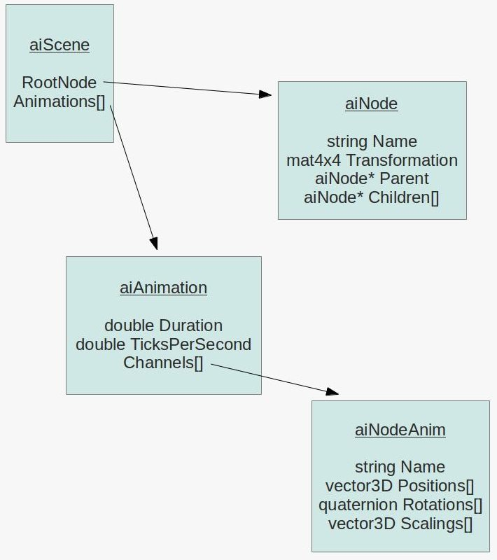

# Skeletal_Animation
## Descriptions

In this assignment, we are asked to use openGL to implement the skeletal animation. The program should be able to load 3D models (.dae, .fbx file format, etc). For each loaded model, there should be a button that can control the animation playback. Besides, the skeletons should be able to be controlled individually. 

The bonus features are using textures for the models, rotating viewpoint by users and implement the skeletons without model imported.

## Environment

> Developed under macOS Montery v12.1

Hardware

* Intel Iris Plus Graphics 1536 MB

Tools

* cmake version v3.22.1

Library

* OpenGL v3.3
* glfw3 v3.2
* glm v0.9.9.8
* assimp v5.1.2
* GLEW v2.2.0

## Execution

We should compile the source code into binary first. The cmake files have been written already. Some dependencies are included under `src/thirdparty`. The other packages that listed in the previous section should be installed by users for their own system. After uccessfully installing these packages, you can use CMake with specified generator to generate project files. Here, we use UNIX makefile as an example.

```bash
# at the root of project
# (option) create the build folder and go to the directory
$ mkdir build && cd build
# generate Unix makefile (specific others, e.g. Xcode, for your needs)
$ cmake -G "Unix Makefiles" ..
$ make
```

You should get the binary file `Skeletal_Animation` under `(project root)/build/bin/Skeletal_Animation`. Execute the file with 3 command line parameters — path for the vertex shader file, path for the fragment shader file and path for the model.

```bash
$ ./build/bin/Skeletal_Animation src/anim_model.vs src/anim_model.fs resource/dog.dae
```


## Method

### Flow

1. Load model using Assimp Library

   It is convenient that the asset import (Assimp) Library could handle the parsing of 3D models. To read the file just use

   ```c++
   #include <assimp/scene.h>
   Assimp::Importer importer;
   const aiScene* scene = importer.ReadFile(modelPath, flags)
   ```

   The data structure of `aiScene` is shown as the following figure [Fig. 1].

   

2. Next, read the meshes and its corresponding bones under the following structure [Fig 2].

   

3. Read the missing bones and the keyframes [Fig. 3].

   

4. Save the bones under hierarchy structure.
5. Update the skeletons each time at render loop

### Interpolation of keyframes

In Figure 3, we have shown the data structure of `aiNodeAnim` which included the name, the position, the rotation, and the scaling of each node in the animation. To calculate the values for the current animation, we need to interpolate between the previous and the next keyframe. These is written in `bone.h` by the following code segment:

```c++
int p0Index = GetPositionIndex(animationTime);
int p1Index = p0Index + 1;
```

The `glm::mix()` method provides a easy way of the linear interpolation. We would use this method for the interpolations of the position and the scaling. However, linear interpolation is not suitable for rotation if we want smooth changes in the rotation of animation. Insteads of linear interpolation, the spherical linear interpolation should be used. The glm library also provides a method called `glm::slerp()` for the interpolation of quaternions. The different between linear and spherical interpolations is clearly shown in equation (1) and equation (2).

$$
Lerp(p_0, p_1; t) = (1-t)p_0 + tp_1
$$

$$
Slerp(p_0, p_1; t) = \frac{sin[(1-t)\Omega]}{sin\Omega} p_0 + \frac{sin[t\Omega]}{sin\Omega}p_1
$$


## Demo

Figure 4 shows an example of loading `resources/model_running.dae` model. A cowboy with costume texture is standing at coordination $(0,0,0)$. A simple imgui at the lower left corner provides some options for model

   

1. Pressed “SPACE” or “Play animation” button for start/stop the animation. 

   

2. Use “W”, “A”, “S”, “D” keys to move the direction of camera.

   

3. Use “Up”, “Down”, “Left”, “Right” keys to move the animator while playing the animation.

  

4. Manipulate the sliders in imgui dialog to rotate the animator in different axises.

  

5. Specify bone moving in the combo box of imgui dialog when playing animation.
    
  


## Troubleshooting

The following are the problems I encountered while writing this assignment.

1. The bone name unmatched with bone in keyframe.
   - The problem would caused file read error in assimp v5.1.2
     - **ERROR::ASSIMP:: Expected different index count in <p> element.**
   - Solution1: use older version of assimp library
   - Solution2: manually modify the name in .dae files

2. Binding integer vector in shader file using `glVertexAttribPointer` works in some graphic cards, but not for MacBook 2020 13”. 
   * Execute correctly on MacBook2020 16”, Mac Pro. 
   * Solution: Insteads of using `glVertexAttribPointer`, it is more correct using `glVertexAttribIPointer` for integer vector.
